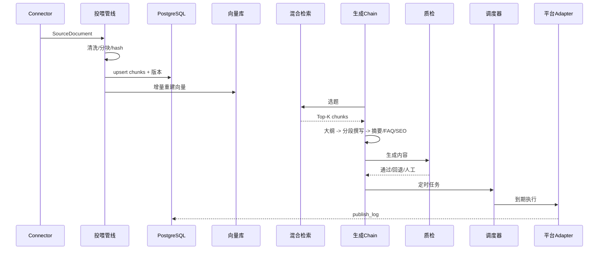
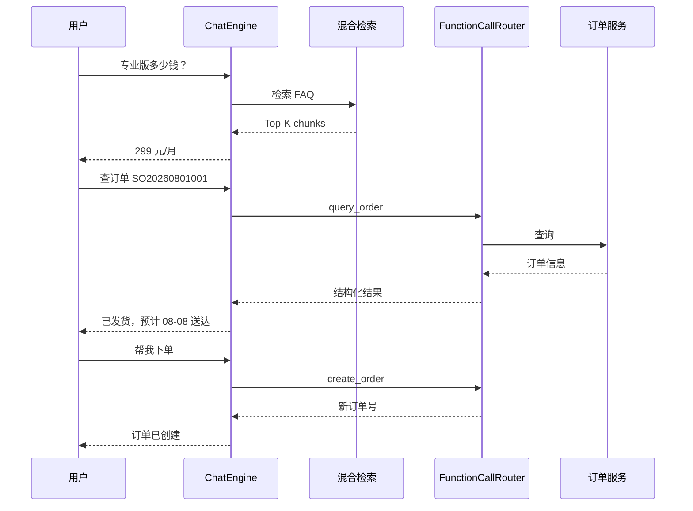

# 架构设计文档

本文档记录 AI 内容生产管线的分层架构与关键设计决策，回答“为什么这么设计”而不是“做了什么”。

## 1. 总体分层

四层 + 一条回流闭环：

1. **投喂层**：异构数据源 -> 统一 `SourceDocument` -> 清洗 -> 分块 -> 向量化。
2. **生成层**：HyDE 检索 -> 大纲 -> 分段撰写 -> 摘要/FAQ/SEO。
3. **质量层**：SimHash -> RAG 事实校验 -> 格式检查。
4. **分发层**：Adapter -> 延时队列 -> 状态机 -> 发布日志。
5. **回流层**：效果数据 -> Prompt A/B、知识库补全（代码中预留接口，见 Roadmap）。

## 2. 关键设计决策

### ADR-01：为什么采用“双轨存储”？

**决策**：向量库（FAISS/Numpy）只存 `doc_id + embedding + chunk_index`；PostgreSQL/SQLite 存 chunk 全文、元数据、版本历史。

**理由**：
- 向量库擅长近似检索，不擅长范围查询、聚合统计、事务性更新；
- 事实校验需要精确回溯“某段内容在什么时间来自哪个文档”，这是关系库的强项；
- 更换向量库（FAISS -> Milvus）不影响业务层，因为 `VectorStore` 只是协议。

### ADR-02：为什么分块要考虑 overlap 与标题感知？

**决策**：默认 `chunk_size=512`、`chunk_overlap=128`；结构化文档走 `HeadingAwareChunker`。

**理由**：切分点是召回率的最大敌人。overlap 让跨边界语义（句子后半段）不丢失；标题感知让 API 文档等结构化内容保持章节完整，避免一个 chunk 横跨两个主题。

### ADR-03：为什么增量更新用内容指纹而不是时间戳？

**决策**：每个 chunk 计算 BLAKE3 `content_hash`，按 hash 判断 新增/变更/不变/删除。

**理由**：
- 时间戳粒度不可靠（同一文件秒级多次编辑）；
- hash 比对可精确到 chunk 级，避免全量重建；
- 删除采用逻辑删除（`is_active + valid_from/valid_to`），支持版本追溯与低峰期物理重建。

### ADR-04：为什么用 HyDE + 混合检索，而不是纯向量检索？

**决策**：检索阶段 = LLM 生成假设文档 -> 向量召回 + BM25 关键词召回 -> 加权融合。

**理由**：
- HyDE 把“关键词查询”转成“语义文档”，提升中文口语化查询的召回率；
- 向量召回漏掉专有名词/精确 ID 时，BM25 兜底；两者融合提高鲁棒性；
- 融合权重可配置（`HYBRID_WEIGHT_VECTOR=0.6`）。

### ADR-05：为什么生成用多步 Chain 而不是单次调用？

**决策**：大纲 -> 分段撰写 -> 质检 -> 润色，每步独立校验。

**理由**：
- 单次长输出在 32K 上下文下仍不稳定，分段生成可控制单步规模；
- 每步可插校验（Schema、事实、格式），失败可精准回退而不是整篇重来；
- 分段撰写天然支持 Map（并行生成）- Reduce（连贯性检查）。

### ADR-06：为什么三层质检要有“无法验证即人工确认”的默认策略？

**决策**：`FactChecker` 对知识库中找不到证据的声明标记 `neutral`（警告），不默认放行。

**理由**：事实性错误（contradiction）是内容管线最严重的失败模式。宁可让运营多看一眼，也不能让错误参数上线。数值类声明（价格/日期/版本）额外做精确比对，弥补 NLI 模型对数值不敏感的缺陷。

### ADR-07：为什么发布失败用指数退避而不是立即重试？

**决策**：`2^n` 秒退避（1s/2s/4s），最多 3 次，之后标记 `failed_permanent`。

**理由**：平台限流/网络抖动通常是瞬时问题，指数退避避免雪崩；永久失败进入人工处理，所有结果写 `publish_log`，保证可审计、可归因。

### ADR-08：为什么 Prompt 要版本化管理？

**决策**：Prompt 模板存 DB，支持多版本、`is_active` 切换、按 `weight` 做 A/B。

**理由**：运营调整 Prompt 不应改代码；A/B 实验需要把“效果数据”与“Prompt 版本”绑定，形成数据驱动优化闭环。

### ADR-09：为什么 demo 模式用确定性 Embedding + Mock LLM？

**决策**：`DeterministicEmbedder`（hash 特征向量）+ `MockLLM`（模板输出）+ 内存队列。

**理由**：面试演示、CI、教学需要零外部依赖可复现；接口与生产实现完全一致，切换只改配置。这本身也证明了架构的可测试性。

### ADR-10：客服系统为什么复用内容管线的检索层？

**决策**：`ChatEngine` 直接复用 `HydeRetriever` + 混合检索 + Prompt Registry，不单独建一套问答系统。

**理由**：官网 FAQ 与内容管线的知识库同源，复用检索层保证口径一致、知识更新一次生效；多轮记忆只做「查询改写 + 最近 N 轮历史」，避免把对话历史全量塞进上下文。

### ADR-11：为什么用 Function Calling 而不是让 LLM 自由发挥？

**决策**：订单查询/下单固定为工具 Schema（`query_order` / `create_order`），意图命中后由代码执行并校验参数。

**理由**：涉及交易的操作必须可审计、可重试、参数可校验；LLM 只负责意图与参数抽取，执行权留在业务代码。`MockOrderService` 与 `HttpOrderService` 接口一致，演示与真实对接只差一个配置。

### ADR-12：为什么 GEO 资产由系统自动生成？

**决策**：发布成功后自动生成/更新 Sitemap，并产出 Article/FAQ/Organization JSON-LD。

**理由**：人工维护 Sitemap 会漏页、过期；结构化数据与内容同生命周期，生成时即可产出，避免二次人工工作。

## 3. 数据流（一次完整发布）

## 4. 扩展点

### 客服交互闭环

| 场景 | 修改位置 |
| --- | --- |
| 新增数据源 | 实现 `DocumentConnector`，注册到 `ConnectorRegistry` |
| 换 Embedding 模型 | 实现 `Embedder`，切换 `EMBEDDING_MODEL` |
| 换向量数据库 | 实现 `VectorStore`（Milvus/PGVector） |
| 新增发布平台 | 实现 `PlatformAdapter`，注册到 `AdapterRegistry` |
| 增加质检规则 | 扩展 `FormatChecker` / `FactChecker` |
| 换调度后端 | 实现 `PublishScheduler`（Redis Stream/RabbitMQ） |
