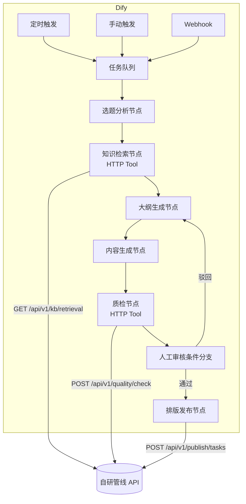
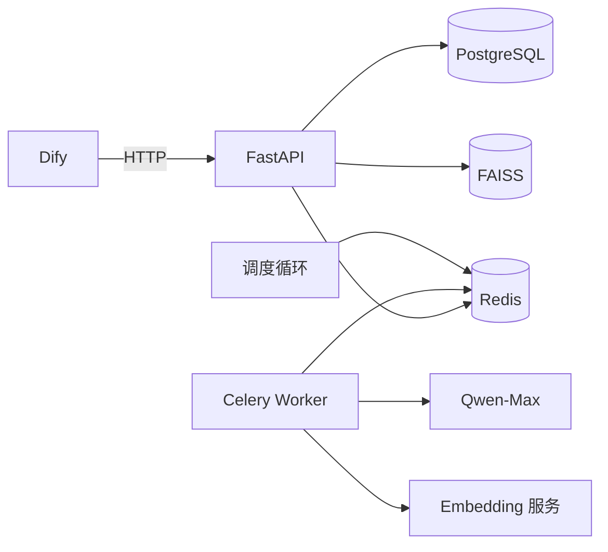

# Dify 工作流集成指南

纯代码实现能力完整，但运营人员需要自主调整 Prompt 与流程。生产实践采用 **Dify 做流程编排、自研管线做能力底座** 的分工：



## 分工边界

| 能力 | 归属 | 理由 |
| --- | --- | --- |
| 流程编排、条件分支、人工审核 | Dify | 运营可视化，无需开发介入 |
| 知识库投喂、混合检索 | 自研 API | 需要深度工程化（增量/双轨/限流） |
| 三层质检 | 自研 API | 需要访问向量库与历史库，结果要可审计 |
| 发布状态机、重试、日志 | 自研 API + Worker | 涉及外部平台凭据与幂等 |
| Prompt 模板 | 自研 Prompt Registry | 支持版本回滚与 A/B 流量分配 |

## 检索 Tool 契约

Dify 自定义工具 `knowledge_retrieval`：

```json
{
  "name": "knowledge_retrieval",
  "description": "从企业知识库检索相关内容",
  "parameters": {
    "type": "object",
    "properties": {
      "query": { "type": "string", "description": "检索问题" },
      "top_k": { "type": "number", "default": 5 },
      "threshold": { "type": "number", "default": 0.75 }
    },
    "required": ["query"]
  },
  "api": {
    "method": "POST",
    "url": "https://your-pipeline.com/api/v1/kb/retrieval",
    "headers": { "Authorization": "Bearer {{api_key}}" }
  }
}
```

## 质检 Tool 契约

```json
{
  "name": "quality_check",
  "description": "三层质检（重复率/事实/格式）",
  "parameters": {
    "type": "object",
    "properties": {
      "content_id": { "type": "string" },
      "title": { "type": "string" },
      "body": { "type": "string" },
      "platform": { "type": "string", "default": "公众号" }
    },
    "required": ["content_id", "title", "body"]
  },
  "api": {
    "method": "POST",
    "url": "https://your-pipeline.com/api/v1/quality/check",
    "headers": { "Authorization": "Bearer {{api_key}}" }
  }
}
```

响应中的 `passed` 驱动 Dify 条件分支：

```text
passed=true  -> 进入人工审核节点
passed=false -> 按 issues[].code 分流：
                duplicate_simhash / format_*  -> 自动重写
                fact_contradiction            -> 高风险，人工复核
```

## Prompt 版本联动

Dify 的 LLM 节点不硬编码 Prompt，而是通过 HTTP 节点从 Prompt Registry 拉取：

```text
GET https://your-pipeline.com/api/v1/prompts/active?prompt_id=outline
```

这样运营在自研后台编辑并发布新版本后，Dify 工作流下次运行自动使用最新版；同一 `prompt_id` 存在多个 active 版本时，按 `weight` 比例分流，实现 A/B 实验。

## 部署拓扑



